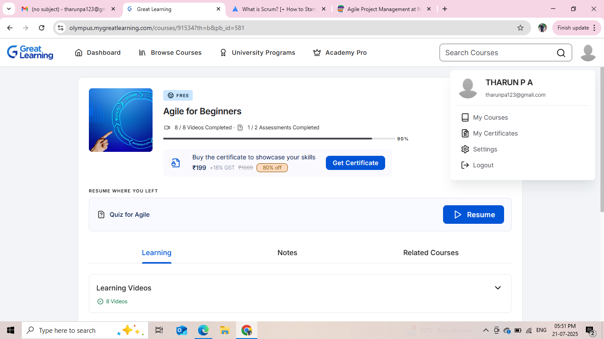
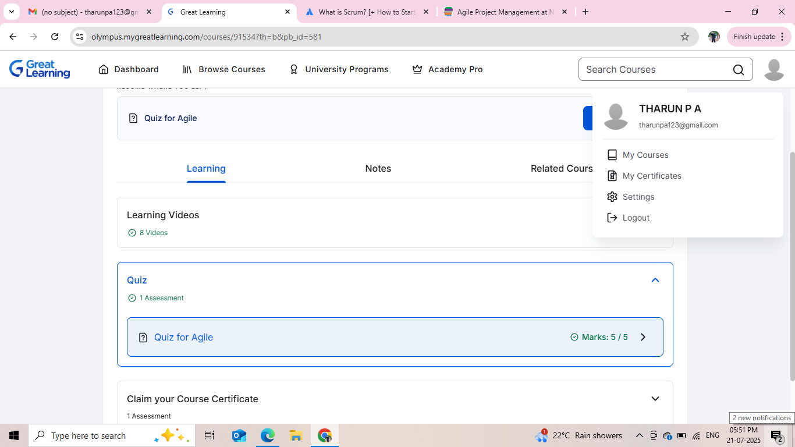

# 5184980_Tharun_P_A

## 📚 Overview

Welcome to my repository! This is a comprehensive record of my learning journey through:

- **📘 SDLC (Software Development Life Cycle)**
- **🛠️ Git & Version Control**
- **🐧 Linux Command Line**
- **💻 C Programming Fundamentals**

It contains **certificates**, **hands-on exercises**, and **practical command-line tasks** to showcase my progress and skills.

---

## 🏆 My Certificates

### **✅ Week 1 – SDLC (Software Development Life Cycle)**

> **Key Concepts Learned:**
> - Understanding **phases of SDLC**: Requirement Gathering, Design, Development, Testing, Deployment, and Maintenance.  
> - Importance of **planning & documentation** for software projects.  
> - Roles of developers, testers, and stakeholders in the process.  
> - Learned **Waterfall, Agile, and Iterative models** of software development.

   
  

---

### **✅ Week 2 – Git & Version Control**

> **Key Concepts Learned:**
> - Introduction to **Version Control Systems (VCS)** and why Git is widely used.  
> - **Basic Git commands**: `git init`, `git add`, `git commit`, `git push`, `git pull`.  
> - Working with **branches** for feature development & collaboration.  
> - Resolving **merge conflicts** and maintaining clean commit history.  
> - Hosting and managing repositories on **GitHub**.

  

---

### **✅ Week 3 – Linux Command Line Practice**

> **Key Concepts Practiced:**
> - Navigating directories & file management
> - Creating, viewing, and editing files (`nano`, `cat`, `head`, `tail`)
> - Sorting, cutting, reversing text (`sort`, `cut`, `rev`)
> - Searching & replacing with `grep` and `sed`
> - Using `awk` for text processing & data extraction
> - File permissions with `chmod`
> - Piping & I/O redirection

📸 **Command execution screenshots:**

  
  
  
  
  
  
  
  
  
  
  

---

### **✅ Week 4 – C Programming Essentials**

> **Topics Covered:**
> - Understanding the structure of a C program
> - Data types, variables, and constants
> - Conditional statements & loops (`if`, `for`, `while`, `switch`)
> - Preprocessor directives (`#include`, `#define`)
> - Compilation using **GCC**
> - Writing modular & reusable C code

  

---

## 🛠️ Skills Learned

- **SDLC**: Phases of software development, requirement analysis, and documentation.  
- **Git**: Version control basics, branching, commits, and repository management.  
- **Linux**:  
  - File management (`ls`, `cp`, `mv`, `rm`, `cat`, `nano`, `head`, `tail`)  
  - Text processing (`sort`, `cut`, `rev`, `grep`, `awk`, `sed`, `tr`)  
  - File permissions (`chmod`) & system info commands (`uname`, `ps`, `df`)  
  - Piping and redirection (`|`, `>`, `>>`)  
- **C Programming**: Program structure, variables, loops, conditionals, compilation, and debugging.  

---

## 🧭 Repository Navigation

Explore the repository for detailed content:

- 📁 [Week 1 - SDLC](./SDLC_week1/)
- 📁 [Week 2 - Git](./Git_week2/)
- 📁 [Week 3 - Linux Commands](./Linux_week3/)
- 📁 [Week 4 - C Programming](./Essentials_of_C_Programming_week4/)

---
